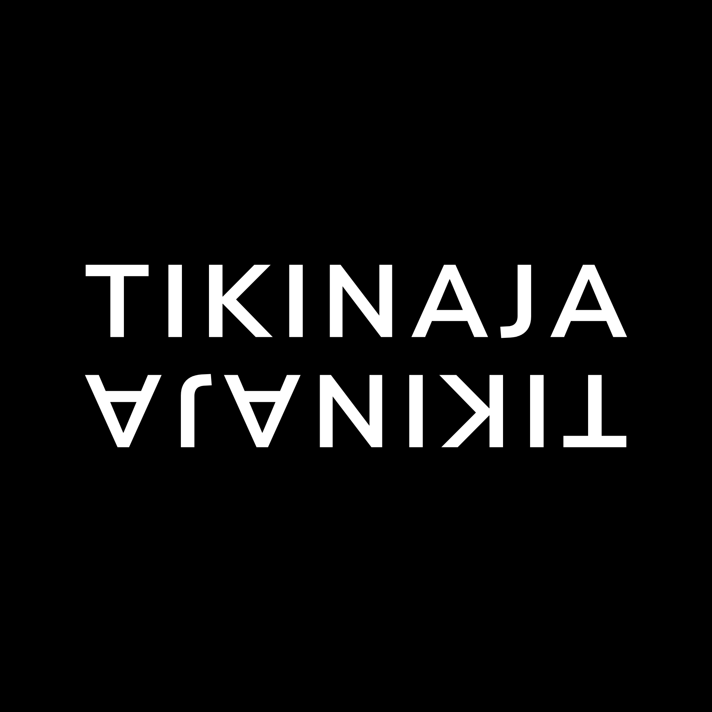

<div align="center">
  
  <h1>Tikinaja</h1>
  <p><strong>Download TikTok videos without watermark & audio (MP3) — fast, free, and open source.</strong></p>
  <p>
    <a href="https://nextjs.org"></a>
    <a href="https://tailwindcss.com"></a>
    <a href="https://www.framer.com/motion"></a>
    
  </p>
</div>

---

## ✨ Fitur

- 🎬 **Download Video No Watermark** — unduh video TikTok dalam kualitas HD tanpa tanda air
- 🎵 **Download Audio (MP3)** — ekstrak audio dari video TikTok
- 📋 **Auto Paste** — paste link langsung dari clipboard dengan satu klik
- 🔗 **Multi Download** — tambahkan banyak link sekaligus dan download semua video secara berurutan
- ⚡ **Fast & Minimal** — UI minimalis hitam-putih, tidak ada iklan, tidak ada tracking
- 🛡️ **CORS-safe** — semua request ke TikWM API dilakukan dari server (Next.js API Routes), bukan dari browser

---

## 🖥️ Preview

> Minimalist black & white design — dark mode by default.

---

## 🚀 Cara Menggunakan

### 1. Buka web Tikinaja
Akses melalui browser.

### 2. Paste link TikTok
Klik tombol **Paste** untuk otomatis paste dari clipboard, atau ketik/paste URL TikTok secara manual.

```
https://www.tiktok.com/@username/video/1234567890
```

### 3. Tambah link (opsional)
Klik **Tambah Link** untuk menambahkan lebih banyak URL TikTok. Anda bisa menambahkan sebanyak yang diinginkan.

### 4. Klik Fetch
Tekan tombol **Fetch Video / Fetch X Videos**. Sistem akan mengambil data setiap video satu per satu secara berurutan.

### 5. Download
Setelah video berhasil diambil, klik:
- **Download Video (No Watermark)** — untuk mengunduh video tanpa watermark
- **Download Audio (MP3)** — untuk mengunduh hanya audio

---

## 🛠️ Tech Stack

| Teknologi | Kegunaan |
|---|---|
| [Next.js 16](https://nextjs.org) | Framework utama (App Router + API Routes) |
| [Tailwind CSS 4](https://tailwindcss.com) | Styling |
| [Framer Motion](https://www.framer.com/motion) | Animasi smooth |
| [Lucide React](https://lucide.dev) | Ikon |
| [TikWM API](https://www.tikwm.com) | Sumber data video TikTok |

---

## 🏗️ Menjalankan Secara Lokal

### Prasyarat
- [Node.js](https://nodejs.org) v18+
- npm

### Langkah-langkah

```bash
# 1. Clone repository
git clone https://github.com/luvices/tikinaja.git
cd tikinaja

# 2. Install dependensi
npm install

# 3. Jalankan development server
npm run dev
```

Buka [http://localhost:3000](http://localhost:3000) di browser.

### Build Production

```bash
npm run build
npm start
```

---

## 📁 Struktur Proyek

```
tikinaja/
├── src/
│   ├── app/
│   │   ├── api/
│   │   │   ├── download/route.ts        # Proxy ke TikWM API
│   │   │   ├── proxy-download/route.ts  # Stream file download ke browser
│   │   │   └── proxy-image/route.ts     # Proxy gambar (bypass CDN hotlink)
│   │   ├── globals.css
│   │   ├── layout.tsx
│   │   └── page.tsx                     # Halaman utama
│   └── components/
│       ├── layout/
│       │   ├── Navbar.tsx
│       │   └── Footer.tsx
│       └── VideoCard.tsx                # Komponen hasil video
├── public/
├── next.config.ts
└── package.json
```

---

## ⚙️ Cara Kerja

1. **User** memasukkan URL TikTok
2. **Next.js API Route** (`/api/download`) fetch data dari [TikWM API](https://www.tikwm.com) menggunakan server-side request (tidak ada CORS issue)
3. URL video & gambar dikembalikan ke frontend
4. Gambar di-proxy melalui `/api/proxy-image` agar tidak diblokir CDN TikTok
5. Download file di-stream melalui `/api/proxy-download` sehingga file langsung terunduh ke perangkat user

---

## ⚠️ Disclaimer

Proyek ini dibuat untuk keperluan edukasi. Gunakan secara bertanggung jawab dan hormati hak cipta kreator konten TikTok. Jangan gunakan untuk mendistribusikan ulang konten tanpa izin.

---

## 📄 Lisensi

[MIT](LICENSE) — bebas digunakan, dimodifikasi, dan didistribusikan.

---

<div align="center">
  <p>Made with ❤️ by <a href="https://github.com/luvices">luvices</a></p>
</div>
